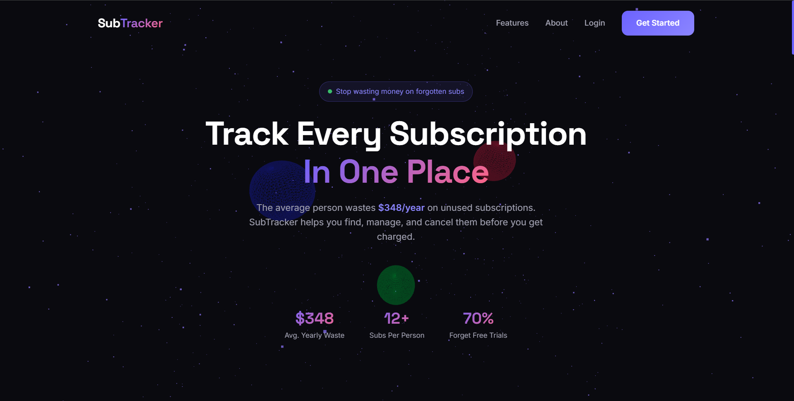
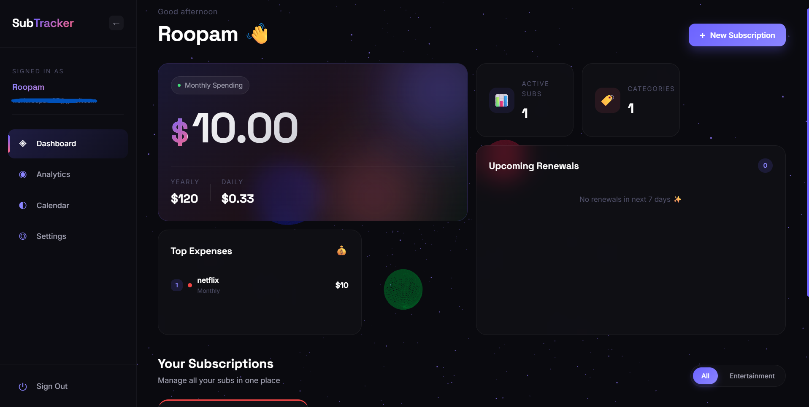
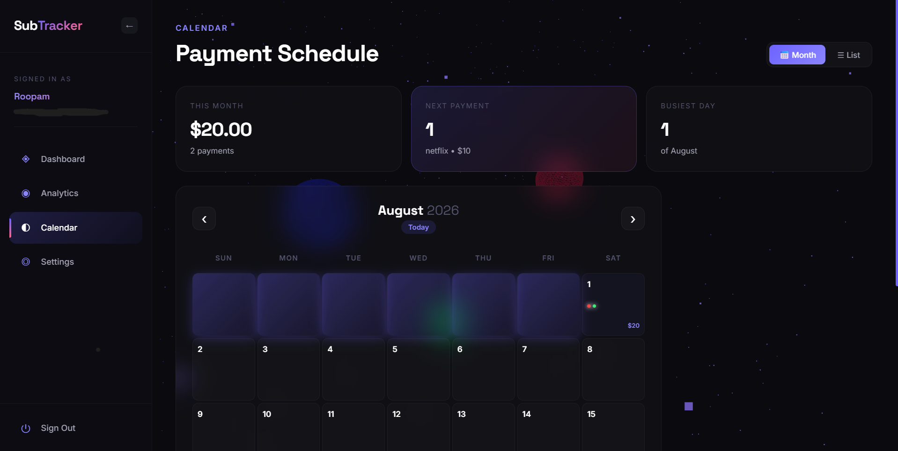
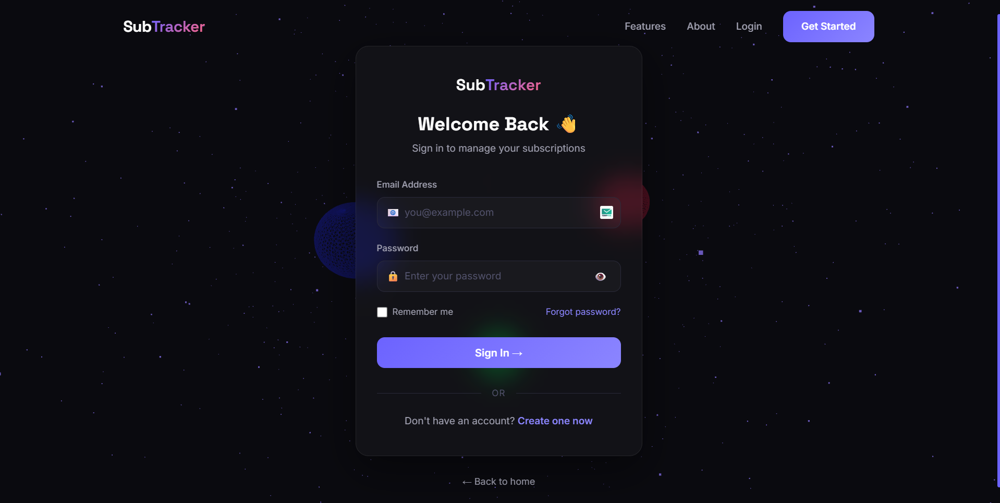

# 🚀 SubTracker

<div align="center">
  <br />
  <h3>Never forget a subscription renewal again</h3>
  <p>A premium subscription tracker with beautiful UI, analytics, and email reminders</p>

  <p>
    <a href="https://subtracker-sandy-mu.vercel.app"><strong>🌐 Live Demo »</strong></a>
    ·
    <a href="#-features">Features</a>
    ·
    <a href="#-tech-stack">Tech Stack</a>
    ·
    <a href="#-installation">Installation</a>
  </p>

  <br />

  
  
  
  
</div>

---

## 🎥 Preview


---

## ✨ Features

- 🎨 **Premium UI** - Award-winning dark theme with Three.js 3D animations
- 📊 **Bento Grid Dashboard** - Beautiful cards showing all your subscriptions
- 📈 **Smart Analytics** - Interactive charts and spending insights
- 📅 **Payment Calendar** - Visual view of all upcoming renewals
- 🔔 **Email Reminders** - Get notified before renewals with cron jobs
- 💰 **Multi-Currency Support** - USD, EUR, GBP, INR, JPY, and more
- 🔐 **Secure Authentication** - JWT-based auth with password hashing
- 📱 **Fully Responsive** - Works perfectly on all devices
- ⚡ **Lightning Fast** - Optimized with Vite for blazing speed
- 🌙 **Dark Theme** - Easy on the eyes, perfect for night owls

---

## 📸 Screenshots

### 🏠 Landing Page


### 📊 Dashboard

(./screenshots/feature.png)

### 📈 Analytics

(./screenshots/analysis2.png)

### 📅 Calendar


### ⚙️ Settings


### Login/Registration

(./screenshots/registration.png)

---

## 🛠️ Tech Stack

### Frontend
- ⚛️ **React 18** - UI library
- ⚡ **Vite** - Build tool
- 🎨 **CSS3** - Custom styling with variables
- 🌌 **Three.js** - 3D animated background
- 💫 **GSAP** - Scroll animations
- 🎭 **Framer Motion** - Page transitions
- 📊 **Recharts** - Data visualization
- 🛣️ **React Router** - Client-side routing
- 📡 **Axios** - HTTP client
- 🔥 **React Hot Toast** - Notifications

### Backend
- 🟢 **Node.js** - JavaScript runtime
- 🚂 **Express** - Web framework
- 🍃 **MongoDB** - NoSQL database
- 🐍 **Mongoose** - ODM for MongoDB
- 🔑 **JWT** - Authentication tokens
- 🔒 **bcryptjs** - Password hashing
- 📧 **Nodemailer** - Email service
- ⏰ **node-cron** - Scheduled jobs
- ✅ **Express Validator** - Input validation

### Deployment
- 🌐 **Vercel** - Frontend hosting
- 🚀 **Render** - Backend hosting
- 🍃 **MongoDB Atlas** - Database hosting

---

## 🚀 Live Demo

Check out the live app: [**https://subtracker-sandy-mu.vercel.app**](https://subtracker-sandy-mu.vercel.app)

### Try it out:
1. Register with any email
2. Add your subscriptions (Netflix, Spotify, etc.)
3. View analytics and calendar
4. Get email reminders before renewals

---

## 💻 Installation

### Prerequisites

Make sure you have installed:
- Node.js 18+ ([Download](https://nodejs.org))
- MongoDB Atlas account ([Sign up](https://mongodb.com/atlas))
- Gmail account with App Password ([Guide](https://support.google.com/mail/answer/185833))

### 1️⃣ Clone the Repository

```bash
git clone https://github.com/roopam2005/subtracker.git
cd subtracker