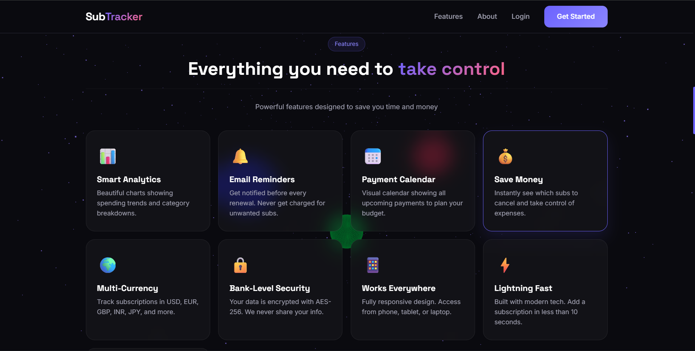
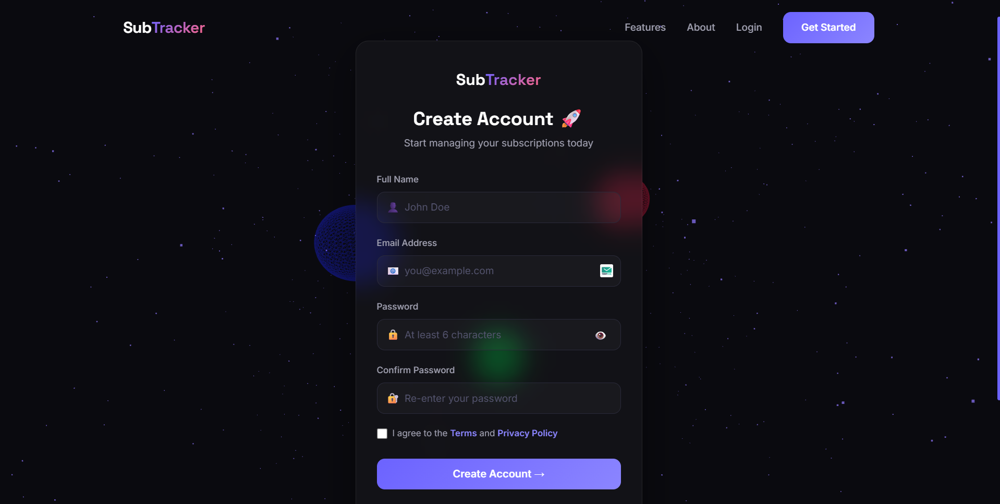
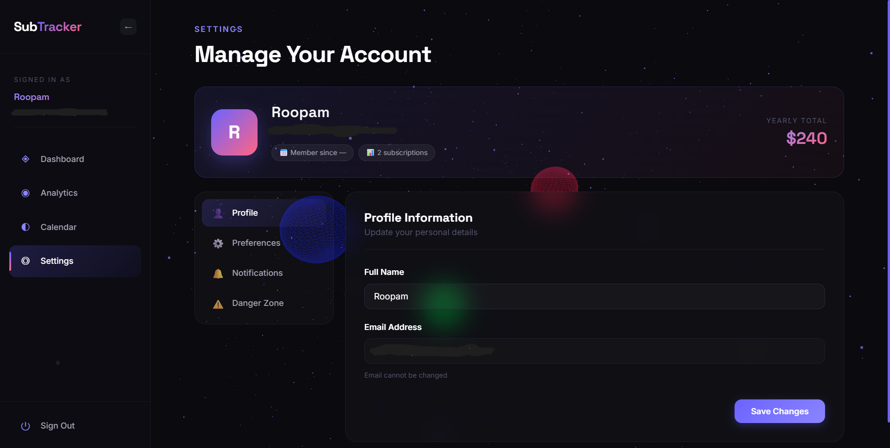

<div align="center">

# 🚀 SubTracker

### Never Forget a Subscription Renewal Again

A premium full-stack subscription tracker with beautiful UI, smart analytics, and email reminders. Built with modern MERN stack and stunning animations.

<br />

### 🌐 [**LIVE DEMO →**](https://subtracker-roopam.vercel.app)

<br />


<br />


</div>

---

## 🎥 Preview


<div align="center">
  
### ✨ [Try It Live Now →](https://subtracker-roopam.vercel.app) ✨

</div>

---

## 📌 About The Project

**SubTracker** solves a real problem - the average person wastes **$348/year** on forgotten subscriptions. This app helps you:

- 📊 Track all your subscriptions in one beautiful dashboard
- 🔔 Get email reminders before renewals
- 📈 Analyze your spending patterns with interactive charts
- 📅 See all upcoming payments in a visual calendar
- 💰 Save money by identifying unused services

Built as a portfolio project showcasing modern full-stack development with premium UI/UX design.

---

## ✨ Features

- 🎨 **Award-Winning UI** - Dark theme with Three.js 3D animated background
- 📊 **Bento Grid Dashboard** - Modern layout inspired by Apple & Vercel
- 📈 **Interactive Analytics** - Beautiful charts with Recharts library
- 📅 **Payment Calendar** - Visual month/list view with payment indicators
- 🔔 **Email Reminders** - Automated cron jobs send renewal alerts
- 💰 **Multi-Currency Support** - USD, EUR, GBP, INR, JPY, and more
- 🔐 **Secure Authentication** - JWT-based auth with bcrypt password hashing
- 📱 **Fully Responsive** - Perfect on mobile, tablet, and desktop
- ⚡ **Lightning Fast** - Built with Vite for blazing performance
- 🎭 **Smooth Animations** - GSAP scroll animations & Framer Motion transitions
- 🎯 **Custom Dropdowns** - Fully custom UI components
- 🌙 **Glass Morphism** - Modern glassmorphic design elements

---

## 📸 Screenshots

### 🏠 Landing Page
Beautiful hero section with Three.js animated background and premium design.


### 🎯 Features Section
Showcasing all the powerful features SubTracker offers.



### 🔐 Login Page
Clean and secure authentication with smooth animations.


### 📝 Registration Page
Simple sign-up process with password strength indicator.



### 📊 Dashboard - Bento Grid Layout
Premium bento grid showing monthly spending, upcoming renewals, and top expenses.


### 📈 Analytics - Overview
Interactive charts showing spending trends and category breakdowns.


### 📈 Analytics - Detailed View
Deep dive into your subscription spending patterns.


### 📅 Calendar View
Visual payment calendar with click-to-view daily details.


### ⚙️ Settings
Manage profile, currency preferences, and notification settings.



---

## 🛠️ Tech Stack

<table>
<tr>
<td valign="top" width="50%">

### Frontend
- ⚛️ **React 18** - UI Library
- ⚡ **Vite** - Lightning-fast build tool
- 🌌 **Three.js** - 3D animated background
- 💫 **GSAP** - Scroll animations
- 🎭 **Framer Motion** - Page transitions
- 📊 **Recharts** - Data visualization
- 🛣️ **React Router** - Routing
- 📡 **Axios** - HTTP client
- 🔥 **React Hot Toast** - Notifications

</td>
<td valign="top" width="50%">

### Backend
- 🟢 **Node.js** - Runtime environment
- 🚂 **Express** - Web framework
- 🍃 **MongoDB** - NoSQL database
- 🐍 **Mongoose** - ODM
- 🔑 **JWT** - Authentication
- 🔒 **bcryptjs** - Password hashing
- 📧 **Nodemailer** - Email service
- ⏰ **node-cron** - Scheduled jobs
- ✅ **Express Validator** - Validation

</td>
</tr>
</table>

### Deployment
- 🌐 **Vercel** - Frontend hosting (Free)
- 🚀 **Render** - Backend hosting (Free)
- 🍃 **MongoDB Atlas** - Database hosting (Free)

---

## 🌟 Live Demo

<div align="center">

### 👉 [**https://subtracker-roopam.vercel.app**](https://subtracker-roopam.vercel.app) 👈

**Try it out yourself:**

1. Click the link above ⬆️
2. Register with any email
3. Add your subscriptions (Netflix, Spotify, Adobe, etc.)
4. Explore the beautiful analytics
5. Check the calendar view
6. Enjoy the smooth animations!

</div>

---

## 🎯 Key Highlights

### 🎨 Design Philosophy
- **Premium Feel** - Every interaction feels smooth and delightful
- **Dark Theme** - Easy on the eyes, modern aesthetic
- **Glass Morphism** - Modern glassmorphic UI elements
- **Micro-interactions** - Hover effects, transitions, animations everywhere

### 🔥 Technical Achievements
- Real-time data updates without page refresh
- Custom animated 3D background with Three.js
- GSAP-powered scroll animations
- Fully custom dropdown components (no ugly native selects)
- Cron-based email reminder system
- JWT authentication with secure cookie handling
- Optimized for performance with Vite
- Mobile-first responsive design

### 💡 UX Features
- Smart greeting based on time of day
- Color-coded urgency indicators for renewals
- Filter subscriptions by category
- Payment amount preview on calendar days
- Sticky panels for better UX
- Loading states and empty states
- Beautiful error handling with toast notifications

---

## 💻 Local Development

### Prerequisites

Make sure you have installed:
- Node.js 18+ ([Download](https://nodejs.org))
- MongoDB Atlas account ([Sign up](https://mongodb.com/atlas))
- Gmail with App Password ([Guide](https://support.google.com/mail/answer/185833))

### 1️⃣ Clone the Repository

```bash
git clone https://github.com/roopam2005/subtracker.git
cd subtracker
```

### 2️⃣ Setup Backend

```bash
cd server
npm install
```

Create `.env` file in `server/` folder:

```env
PORT=5000
NODE_ENV=development
MONGO_URI=your_mongodb_connection_string
JWT_SECRET=your_super_secret_key_here
JWT_EXPIRE=7d
EMAIL_HOST=smtp.gmail.com
EMAIL_PORT=587
EMAIL_USER=your_gmail@gmail.com
EMAIL_PASS=your_gmail_app_password
EMAIL_FROM=SubTracker <your_gmail@gmail.com>
CLIENT_URL=http://localhost:5173
```

Start the backend server:
```bash
npm run dev
```

Server runs on: `http://localhost:5000`

### 3️⃣ Setup Frontend

Open a new terminal:

```bash
cd client
npm install
```

Create `.env` file in `client/` folder:

```env
VITE_API_URL=http://localhost:5000/api
```

Start the frontend:
```bash
npm run dev
```

Client runs on: `http://localhost:5173`

### 4️⃣ Open in Browser

Visit: [http://localhost:5173](http://localhost:5173)

---

## 📂 Project Structure

```
subtracker/
│
├── 📁 server/                    # Backend Application
│   ├── 📁 config/               # Database configuration
│   ├── 📁 controllers/          # Route handlers
│   ├── 📁 middleware/           # Auth & validation middleware
│   ├── 📁 models/               # Mongoose data models
│   ├── 📁 routes/               # API route definitions
│   ├── 📁 jobs/                 # Cron jobs (email reminders)
│   ├── 📁 utils/                # Helper functions
│   ├── 📄 .env                  # Environment variables
│   └── 📄 server.js             # Entry point
│
├── 📁 client/                    # Frontend Application
│   ├── 📁 public/               # Static assets
│   ├── 📁 src/
│   │   ├── 📁 components/       # Reusable components
│   │   │   ├── 📁 Sidebar/
│   │   │   ├── 📁 Navbar/
│   │   │   ├── 📁 ThreeBackground/
│   │   │   ├── 📁 SubscriptionCard/
│   │   │   ├── 📁 AddSubscriptionModal/
│   │   │   ├── 📁 CustomSelect/
│   │   │   └── 📁 ProtectedRoute/
│   │   ├── 📁 pages/            # Page components
│   │   │   ├── 📁 Landing/
│   │   │   ├── 📁 Login/
│   │   │   ├── 📁 Register/
│   │   │   ├── 📁 Dashboard/
│   │   │   ├── 📁 Analytics/
│   │   │   ├── 📁 Calendar/
│   │   │   └── 📁 Settings/
│   │   ├── 📁 context/          # React Context (Auth, Subs)
│   │   ├── 📁 utils/            # API & helpers
│   │   ├── 📄 App.jsx           # Main app component
│   │   └── 📄 main.jsx          # Entry point
│   ├── 📄 .env                  # Environment variables
│   └── 📄 vite.config.js        # Vite configuration
│
├── 📁 screenshots/               # App screenshots
└── 📄 README.md                 # You are here!
```

---

## 🔌 API Endpoints

### 🔐 Authentication Routes

| Method | Endpoint | Description |
|--------|----------|-------------|
| `POST` | `/api/auth/register` | Register a new user |
| `POST` | `/api/auth/login` | Login user |
| `GET` | `/api/auth/me` | Get current user info |
| `PUT` | `/api/auth/updateprofile` | Update user profile |
| `POST` | `/api/auth/logout` | Logout user |

### 📦 Subscription Routes

| Method | Endpoint | Description |
|--------|----------|-------------|
| `GET` | `/api/subscriptions` | Get all user subscriptions |
| `POST` | `/api/subscriptions` | Add new subscription |
| `GET` | `/api/subscriptions/:id` | Get single subscription |
| `PUT` | `/api/subscriptions/:id` | Update subscription |
| `DELETE` | `/api/subscriptions/:id` | Delete subscription |

### 📊 Analytics Routes

| Method | Endpoint | Description |
|--------|----------|-------------|
| `GET` | `/api/analytics/summary` | Get spending summary |
| `GET` | `/api/analytics/category` | Get by category breakdown |
| `GET` | `/api/analytics/upcoming` | Get upcoming renewals |
| `GET` | `/api/analytics/monthly` | Get monthly spending trend |

---

## 🚀 Deployment Guide

### Deploy Backend (Render)

1. Push your code to GitHub
2. Create account at [render.com](https://render.com)
3. Click **New +** → **Web Service**
4. Connect your GitHub repo
5. Configure:
   - **Root Directory:** `server`
   - **Build Command:** `npm install`
   - **Start Command:** `npm start`
6. Add environment variables
7. Click **Create Web Service**

### Deploy Frontend (Vercel)

1. Create account at [vercel.com](https://vercel.com)
2. Click **Add New Project**
3. Import your GitHub repo
4. Configure:
   - **Framework:** Vite
   - **Root Directory:** `client`
5. Add environment variable:
   - `VITE_API_URL` = `https://your-backend.onrender.com/api`
6. Click **Deploy**

### Configure MongoDB Atlas

1. Create free cluster at [mongodb.com/atlas](https://mongodb.com/atlas)
2. Add database user
3. Whitelist all IPs (`0.0.0.0/0`)
4. Copy connection string
5. Add to your `.env` file

---

## 🎨 Design Inspiration

The design draws inspiration from:
- 🎨 **Apple** - Bento grid layouts
- ▲ **Vercel** - Dark theme aesthetics
- 📐 **Linear** - Smooth animations
- 💎 **Notion** - Clean typography

---

## 🗺️ Future Roadmap

- [ ] 🌙 Light/Dark theme toggle
- [ ] 🔐 Google & GitHub social login
- [ ] 📤 Export data to CSV/PDF
- [ ] 📱 Progressive Web App (PWA)
- [ ] 🔔 Browser push notifications
- [ ] 🌍 Multi-language support (i18n)
- [ ] 👥 Family/team plans
- [ ] 💳 Bank integration via Plaid API
- [ ] 🤖 AI-powered spending insights
- [ ] 📊 Advanced reporting features

---

## 🐛 Known Issues

- ⏰ Backend on Render free tier sleeps after 15 min of inactivity
  - **First request may take 30-60 seconds** to wake up
  - **Solution:** Use [cron-job.org](https://cron-job.org) to ping every 14 minutes

---

## 💡 Why I Built This

As a full-stack developer, I wanted to build a project that:

✅ Demonstrates modern web development skills  
✅ Solves a real-world problem  
✅ Has premium UI that stands out  
✅ Uses cutting-edge technologies  
✅ Is production-ready and deployed  
✅ Would impress potential employers  

This project showcases my ability to build **complete, production-grade applications** from concept to deployment.

---

## 🤝 Feedback & Contact

I'd love to hear your thoughts on SubTracker!

- 🌟 **Star this repo** if you liked it
- 🐛 **Report bugs** by opening an issue
- 💡 **Suggest features** via GitHub Discussions
- 📧 **Contact me** for collaboration opportunities

---

## 👨‍💻 About The Developer

Hi! I'm **Roopam**, a passionate full-stack developer who loves building beautiful, functional web applications.

### 🔗 Connect With Me

- 💼 **GitHub:** [@roopam2005](https://github.com/roopam2005)
- 🌐 **Portfolio:** [Coming Soon]
- 💌 **Email:** roopamrv05@gmail.com

### 🎯 What I'm Looking For

- 🚀 Full-stack development opportunities
- 💼 Frontend/React developer roles
- 🎨 UI/UX focused projects
- 🌟 Interesting SaaS products to build

---

<div align="center">

## ⭐ If You Liked This Project

**Please give it a star!** It helps others discover the project and motivates me to build more amazing things.

### 🌐 [Visit SubTracker Live →](https://subtracker-roopam.vercel.app)

<br />

### 💜 Made with love using MERN Stack

<br />

**© 2025 SubTracker - Built by Roopam**

<br />


</div>